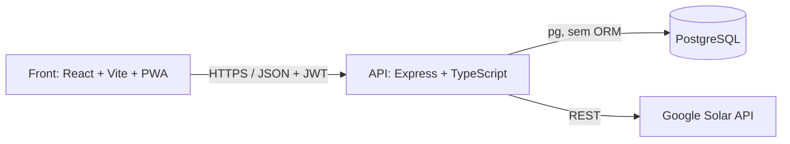

# Solar Costa — CRM para empresa de energia solar

Sistema de gestão comercial e operacional para uma empresa de energia solar fotovoltaica: do primeiro contato do lead até a obra homologada na concessionária, com site institucional próprio servido pela mesma aplicação.

---

## O problema

O ciclo de venda de energia solar é longo e passa por etapas que raramente conversam entre si: captar o lead, dimensionar o sistema, calcular geração e retorno, emitir proposta, fechar contrato, comprar o kit, executar a obra, homologar na concessionária e cobrar. Na maioria das empresas isso vive espalhado em planilhas, WhatsApp e e-mail, e ninguém sabe dizer onde um cliente parou.

Aqui o ciclo inteiro vive em um banco só, com histórico por etapa e trilha de auditoria.

## Módulos

| Módulo | O que faz |
|---|---|
| **Leads** | Funil em kanban, histórico de interações, documentos, origem e geolocalização |
| **Propostas** | Calculadora de dimensionamento com perfil de geração mensal, itens, cláusulas e exportação em PDF |
| **Contratos** | Geração a partir da proposta aprovada, com cláusulas padrão configuráveis |
| **Obras** | Kit de equipamentos, acompanhamento de homologação na concessionária e histórico |
| **Financeiro** | Categorias, lançamentos, bancos de financiamento e relatórios |
| **Agenda** | Calendário interativo de visitas técnicas e instalações |
| **Catálogo** | Fornecedores, produtos e movimentação de estoque |
| **Usuários** | Papéis, permissões por usuário, sessões e trilha de auditoria |
| **Site** | Site institucional com CMS de blocos, SEO e páginas públicas |

## Arquitetura



O navegador nunca fala direto com o banco — tudo passa pela API. Em produção, um único container Express serve `/api/*` e entrega o `index.html` do React para todo o resto (SPA fallback).

## Stack

**Front** — React 19, TypeScript, Vite, Tailwind CSS, React Router, Recharts, PWA com service worker
**API** — Node 20, Express 4, TypeScript estrito, `pg` sem ORM, JWT com refresh token, bcryptjs, Zod, Helmet, rate limiting
**Banco** — PostgreSQL: 36 tabelas, migrations versionadas, views, funções e triggers, papéis de acesso separados e rotina diária via `pg_cron`
**Integrações** — Google Solar API (irradiação e dimensionamento), Google Gemini

## Estrutura

```
├── src/               # front React (app + site institucional + PWA)
├── server/            # API Express — ver server/README.md
│   └── src/routes/    # leads, propostas, contratos, obras, financeiro,
│                      # agenda, catálogo, usuários, site, público, solar
├── database/
│   ├── migrations/    # V001 … V008, aplicadas em ordem
│   ├── seeds/         # S001 configuração base · S002 dados de demonstração
│   └── rollback/      # R001 derruba tudo
├── deploy/            # nginx, backup, instalação e troca de senha do admin
└── Dockerfile         # build do front + API em uma imagem só
```

## Como rodar

Pré-requisitos: Node 20+, PostgreSQL 14+.

```bash
# 1. Banco: crie os papéis e aplique migrations e seeds na ordem
#    (detalhes e ordem exata em server/README.md)
psql -f database/02_papeis.sql
psql -f database/migrations/V001__schema_inicial.sql   # … até V008
psql -f database/seeds/S001__configuracao_base.sql

# 2. API (porta 4000)
cd server && npm install && cp .env.example .env
npm run dev

# 3. Front (porta 3000)
npm install && npm run dev
```

A API se recusa a subir se o banco não responder ou se faltar alguma migration — e diz qual falta.

> **Nunca conecte a API como `postgres`.** O `database/02_papeis.sql` cria o papel `solarcosta_app`, com o mínimo de privilégio necessário. O `.env` está no `.gitignore`; não comite valores reais.

## Deploy

Imagem Docker única, sem `docker-compose`: o `Dockerfile` da raiz builda front e API e sobe um container Express na porta 80. O passo a passo no Easypanel está em [`EASYPANEL.md`](./EASYPANEL.md), e os scripts de nginx, backup e manutenção em [`deploy/`](./deploy).

## Documentação relacionada

- [`server/README.md`](./server/README.md) — setup detalhado da API, autenticação e exemplos de chamadas
- [`EASYPANEL.md`](./EASYPANEL.md) — deploy em produção
- [`deploy/README.md`](./deploy/README.md) — infraestrutura, backup e rotinas

---

Projeto em evolução contínua.
